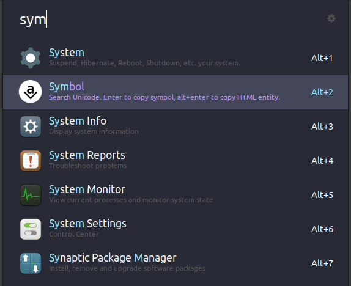

# ulauncher-symbol

A [Ulauncher](https://ulauncher.io/) extension for searching Unicode and ASCII characters and copying them to the clipboard. Dark mode friendly.

<kbd>Enter</kbd> to copy the symbol itself.

<kbd>Alt+Enter</kbd> to copy the HTML entity (if it exists).

You can search for characters using their name or description, block names or the characters themselves.

## Demonstration

## Installation

Open Ulauncher, go to `Preferences > Extensions > Add extension` and paste the project's URL: `https://github.com/rootwork/ulauncher-symbol.git`

You can also view this extension on the [Ulauncher Extensions website](https://ext.ulauncher.io/-/github-rootwork-ulauncher-symbol).

## Source

Forked from [zensoup/ulauncher-unicode](https://github.com/zensoup/ulauncher-unicode) to add HTML entities, dark mode theming, fewer false positives in results, and an updated Unicode list.

## License

GPLv3. See [LICENCE](LICENCE).